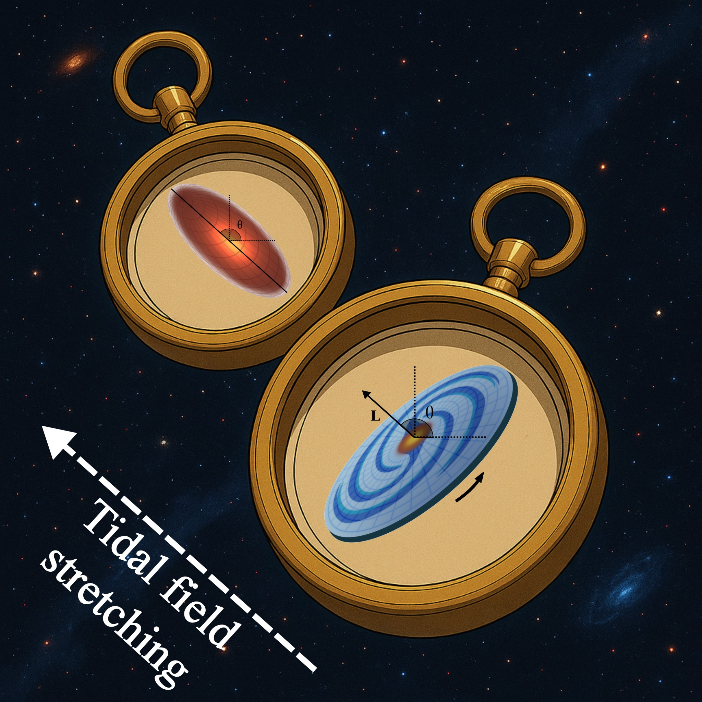

# LAIA - Large-Scale Axial Intrinsic Alignment
This repository contains the Python implementation of the estimator and mock-generation pipeline used in the paper “Where Galaxies Point: First Measurement of the Large-Scale Axial Intrinsic Alignment” (arXiv:2511.10005).

# A new cosmic compass


-----------------------------------------------------
# LAIA maps and PSF-corrected estimator

This repository contains the Python implementation of the estimator and mock pipeline used in the paper:
> **“Where Galaxies Point: First Measurement of the Large-Scale Axial Intrinsic Alignment”**   
> arXiv: [2511.10005](https://arxiv.org/abs/2511.10005)

The code builds HEALPix maps of orientation fields from galaxy catalogs, applies PSF-leakage corrections, and estimates the **Large-Scale Axial Intrinsic Alignment (LAIA)** direction and amplitude, with bootstrap errors.

If you use this code, please cite the paper above.

---

## Overview

At a high level, the pipeline does:

1. **Construct orientation maps** on the sphere:
   - $E^a(\hat{\mathbf d})$: built from the galaxy **a-axes** (e.g. semi-major axes).
   - $E^b(\hat{\mathbf d})$: built from the galaxy **b-axes** (e.g. semi-minor axes).
   - $E^{ab}(\hat{\mathbf d})$: cross-term.
   - $E^{a-b}(\hat{\mathbf d}) = E^a - E^b$.

2. **Find the LAIA directions and amplitudes**:
   - Preferred directions for the individual axes:
     $\hat{\mathbf d}_{\rm IA}^a = \arg\max E^a$,  
     $\hat{\mathbf d}_{\rm IA}^b = \arg\max E^b$.
   - Angular amplitudes $\theta_{\rm IA}^{a,b}$ via the analytic inversion
     implemented in `recover_alpha`.

     Also computes:
   - Spin-2 direction (complex field)
     $$
       E(\hat{\mathbf d}) = E^{a-b}(\hat{\mathbf d}) + i\,E^{ab}(\hat{\mathbf d}) \, ,
     $$
     and $\hat{\mathbf D}_{\rm IA} = \arg\max_{\hat{\mathbf d}} |E(\hat{\mathbf d})|$.

3. **Correct for PSF leakage**:
   - Fit a complex spin-2 leakage parameter $\eta_c$ and real axis-wise
     leakage parameters $\eta_a, \eta_b$ (the real ones are used in the article).
   - Build residual maps with PSF contributions subtracted.

4. **Estimate uncertainties** via **block bootstrap** in HEALPix space.

The main estimator + bootstrap implementation lives in (name adjustable):

- `laia_maps.py`  ← main script/module 
- `laia_maps_alt_it.py` ← optional iterative 

In what follows we will refer to the main script as `laia_maps.py`; if you use a
different filename, just adjust the commands accordingly.

---

## Relationship to the paper

- The code reproduces the LAIA analysis in  
  *“Where Galaxies Point: First Measurement of the Large-Scale Axial Intrinsic Alignment”*.
- For the **LAIA measurements used in the paper**, we work with:
  - $E^a$ and $E^b$ maps,
  - $\theta_{\rm IA}^{a}$ and $\theta_{\rm IA}^{b}$ from `recover_alpha`.

### About $E^{ab}$ and $E^{a-b}$

Besides $E^a$ and $E^b$, the code also builds the cross-term $E^{ab}$ and the combination $E^{a-b} = E^a - E^b$. These are:

- **Not used** in the LAIA results presented in the paper.
- Implemented for:
  - internal consistency checks,
  - and to enable **future extensions** of the analysis inspired by the original
    orientation/shape statistics introduced by **Peebles (1969)** and **Hawley & Peebles (1975)**.

In other words: $E^{ab}$ and $E^{a-b}$ are *fully computed and saved*, but the
current paper and the LAIA estimator focus on $E^a$ and $E^b$.

---

## Installation

Create an environment (conda, mamba, etc.) with the usual scientific stack:

```bash
conda create -n laia python=3.11
conda activate laia

pip install numpy scipy healpy astropy matplotlib
```

Dependencies (as seen in the imports):

- `numpy`
- `scipy` (for `brentq`, `newton`)
- `healpy`
- `astropy` (tables, FITS I/O, SkyCoord)
- `matplotlib` (only for optional plotting)
- `glob`, `os`, `time`, `math` (standard library)

---

## Input catalog format (this can be generated with the sample_organizer.ipynb code from the position angles, ra and dec, or with mocks by mocks.py, see below)

The estimator expects FITS tables with (at least) the following columns:

- Orientation vector in the **tangent plane**:

  ```text
  g_rot_x, g_rot_y, g_rot_z   # components of a tangential unit vector
  ```

- Line-of-sight unit vector:

  ```text
  n_x, n_y, n_z               # direction of the galaxy on the sphere
  ```

- Optional per-galaxy angular uncertainty (in radians):

  ```text
  sigma                        # if present, used to build inverse-variance weights
  ```

Two types of catalogs are typically used:

1. **Observed catalog** (galaxy shapes)  
   - `g_rot_*` correspond to galaxy orientations semi-major axis vector (Cartesian x,y,z components), semi-minor is computed from it.

2. **PSF catalog** (PSF shapes)  
   - `g_rot_*` correspond to PSF orientation vectors at the galaxy positions.

The PSF catalog must be aligned object-by-object with the observed catalog
(same ordering / indexing).

---

## Basic usage

### 1. Configure paths and names

In `laia_maps.py` (inside the `if __name__ == "__main__":` block), adjust:

```python
input_dir  = "path/to/observed_catalogs"
output_dir = "path/to/output_directory"

obs_name = "observed_catalog"         # e.g. "my_obs_catalog"
psf_name = "observed_catalog_psf"     # e.g. "my_obs_catalog_psf"
```

This corresponds to files:

```text
<input_dir>/observed_catalog.fits
<input_dir>/observed_catalog_psf.fits
```

All results will be written under:

```text
<output_dir>/
```

You can then simply run:

```bash
python laia_maps.py
```

This will:

1. Build maps for OBS and PSF at `NSIDE = 32` using `run_estimator_new`.
2. Perform a **direct PSF-corrected LAIA measurement** using
   `analyze_with_psf_corrections`.
3. Optionally run a **bootstrap with PSF + additional lensing-like signal**
   if `DO_BOOTSTRAP_WITHPSF_LENS = True`.

---

### 2. What `run_estimator_new` produces

For an input catalog `<base>.fits`, `run_estimator_new` writes:

```text
<output_dir>/<base>_Ea.fits
<output_dir>/<base>_Eb.fits
<output_dir>/<base>_Eab.fits
<output_dir>/<base>_Ea_minus_b.fits
<output_dir>/<base>_stats.txt
```

- The `_Ea`, `_Eb`, `_Eab`, `_Ea_minus_b` files are **HEALPix maps** with
  headers:
  - `NSIDE`, `ORDERING = "NESTED"`, and `SIMFILE = <original FITS name>`.
- The `stats.txt` file contains:
  - `C_BAR`
  - `SIGMA_MEAN`
  - `SIGMA_WMEAN`
  - `N_GAL`
  - `HALFSKY` (1 if only the northern hemisphere was evaluated, 0 for full-sky)

The code uses:

- per-galaxy `sigma` (if present) to build **inverse-variance weights**, or
- a HEALPix `error_map` to assign sigma per object.

---

### 3. Direct LAIA measurement (with PSF correction)

The direct PSF-corrected measurement in the `__main__` block does:

1. Load the maps:

   ```python
   Ea_obs, Eb_obs, Eab_obs  # from observed catalog maps
   Ea_psf, Eb_psf, Eab_psf  # from PSF catalog maps
   Cbar, stats              # from <base>_stats.txt
   ```

2. Call:

   ```python
   res_direct = analyze_with_psf_corrections(
       Ea_obs, Eb_obs, Eab_obs,
       Ea_psf, Eb_psf, Eab_psf,
       nside=nside_maps, c_bar=Cbar, nest=True,
       de_leak_mode="baseline",
       baseline_real=0.5,
       baseline_complex=0.0,
   )
   ```

This returns (among others):

- `res_direct["eta_complex"]` : complex spin-2 leakage \(\eta_c\).
- `res_direct["eta_a"]`, `res_direct["eta_b"]` : axis-wise leakages.
- `res_direct["D_IA"]` : LAIA direction from the complex field
  \(E^{a-b} + i\,E^{ab}\).
- `res_direct["A_IA"]` : amplitude \(|E(D_{\rm IA})| / \bar C\).
- `res_direct["d_IA_a"]`, `res_direct["d_IA_b"]`:
  - RA/Dec and Galactic coordinates of the preferred directions for a and b.
- `res_direct["theta_IA_a_arcmin"]`, `res_direct["theta_IA_b_arcmin"]`:
  - LAIA angular amplitudes in arcminutes.

The script then writes a **one-row FITS table** with these quantities:

```text
<output_dir>/<obs_name>_analysis_obs_psf.fits
```

---

### 4. Bootstrap uncertainties

For block-bootstrap error estimation, use:

```python
bootstrap_errors_from_catalog(
    arquivo_fits=arquivo_fits_obs,
    error_map=error_map,                 # None -> use per-galaxy sigma
    arquivo_fits_psf=arquivo_fits_psf,
    with_psf=True,
    lensing=True,
    lensing_theta_arcmin=1.0,
    lensing_nside_dir=4096,
    B=BOOT_B,
    nside_blocks=16,
    nside_eval=nside_maps,
    half_sky=HALF_SKY,
    nest=True,
    outdir=os.path.join(output_dir, BOOT_SUBDIR),
    seed=1337,
    sigma_col="sigma",
    save_residual_maps=False,
)
```

This will:

- Perform **block-bootstrap realizations** using HEALPix blocks
  at `NSIDE = nside_blocks`.
- For each realization:
  - Resample blocks with replacement.
  - Recompute orientation maps (`_compute_maps_from_arrays`).
  - Optionally inject a small IA/lensing-like rotation around a random
    direction.
  - Run `analyze_with_psf_corrections` (if `with_psf=True`) or
    `analyze_dual_and_DIA`.
- Write a summary FITS file containing one row per bootstrap realization:

```text
<outdir>/<base>_bootstrap_ns<nside_blocks>_B<B>_<mode>[...].fits
```

To **aggregate** bootstrap results over multiple simulations (or over the
observational case following the same pattern), use:

```python
aggregate_bootstrap_results_for_all_sims(
    output_dir,
    prefix="simulation_d_xyz_t_0_sim_",
    sims=range(10),
    boot_subdir="boot",
    mode="withpsf_lens",
    nest=True,
)
```

This produces:

```text
<output_dir>/summary_bootstrap_<mode>.fits
```

with:

- median and credible intervals (p16/p84, p2.5/p97.5) for:
  - \(A_{\rm IA}\), (not used in the paper)
  - \(\theta_{\rm IA}^a\),
  - \(\theta_{\rm IA}^b\);
- mean LAIA direction and angular scatter:
  - median RA/Dec,
  - \(r_{68}\), \(r_{95}\) in degrees.

---

### 5. Batch analysis

- `batch_analyze(...)` – without PSF, using `analyze_dual_and_DIA`.
- `batch_analyze_with_psf(...)` – with PSF, using `analyze_with_psf_corrections`.

Both functions:

- loop over `files` (e.g. `range(10)`),
- read the corresponding maps and stats from `output_dir`,
- compute LAIA quantities per simulation/bootstrap sample,
- save:
  - one analysis FITS per simulation/bootstrap sample (`*_analysis_nopsf.fits`,
    `*_analysis_psf.fits`),
  - and a summary table over all simulations/bootstrap samples (`summary_IA_*.fits`,
    `summary_IA_*.ascii.ecsv`).

---

## Iterative (`laia_maps_alt_it.py`)

The LAIA direction and amplitudes can be obtained directly from a **single**
evaluation of the maps at `NSIDE = 32`, as implemented in `laia_maps.py`:

- For most purposes, **one iteration at `NSIDE = 32` is sufficient**.

However, for users who want to **experiment with higher resolution**, the repository also includes an alternate script:

- `laia_maps_alt_it.py`

which implements a **multi-resolution search**:

1. Start from the LAIA direction(s) found on coarse maps (e.g. `NSIDE = 32`).
2. Refine the maximum of $E^a$, $E^b$ by:
   - iterating the estimator on smaller patches, or
   - increasing NSIDE (e.g. 64, 128) around the candidate direction.
3. Update the direction and repeat until max nside.

In practice, tests show that:

- Going from `NSIDE = 32` to higher NSIDE **does not significantly change** the inferred LAIA directions for the DES Y3 analysis in the paper.
- The iterative script is therefore best seen as a **diagnostic / robustness tool**, or as a starting point for future higher-resolution studies.

---

## Notes on performance

- The estimator processes galaxies in chunks (`gal_chunk`), so you can tune
  this parameter to fit your available RAM.
- All maps are computed in **NESTED** ordering, which is indicated in the FITS
  headers and used consistently throughout the code.
- For large samples, it may be convenient to:
  - keep `show_plot=False` (default),
  - and inspect the final maps with your own plotting scripts.

---


```

```
## What the script laia_maps_alt_it.py does

The key pieces are:

- `compute_chi2_for_pixels(...)`  
  Computes the χ²-like map for a *given* list of HEALPix pixels at a chosen NSIDE, using:
  - the 3D orientation vectors `g` (here already rotated: `g_rot_*`),
  - the position vectors `n`,
  - an error map giving the per-direction uncertainty σ(𝑛̂),
  - and chunked processing over galaxies for memory efficiency.

- `run_estimator_g_rot(...)`  
  1. Reads a simulation/observed catalog (FITS) containing `g_rot_x`, `g_rot_y`, `g_rot_z`
     and `n_x`, `n_y`, `n_z`.  
  2. Builds a full χ² map at `nside1` (default 32) over the (half-)sky, and optionally
     saves/plots it.  
  3. Performs the iterative refinement through higher NSIDE values (defaults:
     32 → 1024 → 4096 → 16384 → 32768), always keeping:
        - the max pixel,
        - its 8 neighbours,
        - the χ² value at the max, and
        - the corresponding LAIA angle θ_IA = α(g_max) via `recover_alpha`.  
  4. Writes:
        - a FITS map with the coarse χ² field at NSIDE = 32; and
        - a FITS table summarising the iterative results at each NSIDE.

At the bottom of the file there is an example driver loop that:

- defines `input_dir` and `output_dir` (you should replace these with your own paths),
- reads an error map (e.g. `shape_catalog_error.fits`),
- loops over a set of simulations,
- calls `run_estimator_g_rot(...)` for each simulation, and
- stores the returned maps and iterative summaries in memory (in the `resultados_g_rot` list).

You are encouraged to adapt this part to your own directory structure and file naming scheme.

### Running the iterative estimator

1. Prepare a HEALPix error map, for example:

   - `shape_catalog_error.fits` (NSIDE chosen by you), containing σ(𝑛̂) in radians
     or in the same units used in the main estimator.  
   - The code assumes NESTED ordering for the error map.

2. Prepare one or more FITS catalogs with columns:

   - `n_x`, `n_y`, `n_z`  – unit vectors pointing to each galaxy (ICRS frame in the paper);  
   - `g_rot_x`, `g_rot_y`, `g_rot_z` – rotated orientation vectors in the tangent plane;  
   - optionally, any other columns you might want for book-keeping (they are ignored here).

3. Edit the bottom of `estimator_alt_it.py`:

   - Set:
     ```python
     input_dir  = "path/to/your/simulations"
     output_dir = "path/to/your/output"
     error_map  = hp.read_map("path/to/your_error_map.fits", nest=True)
     ```
   - Adjust the loops over simulations, e.g.:
     ```python
     for j in range(N_sims):
         fits_path = os.path.join(input_dir, f"simulation_d_xyz_t_0_sim_{j}.fits")
         chi2_map_rot, iterative_results = run_estimator_g_rot(
             fits_path,
             error_map,
             nside1=32,
             nside2=1024,
             nside3=4096,
             nside4=16384,
             nside5=32768,
             chunk_size=50000,
             show_plot=False,
             output_dir=output_dir,
         )
     ```

4. Run:

   ```bash
   python estimator_alt_it.py
   ```

5. Inspect the outputs in `output_dir`:

   - `*_g_rot_chi2.fits` – NSIDE = 32 χ² map;  
   - `*_g_rot_iterative_results.fits` – table with one row per NSIDE, including the
     best pixel, χ² value, and θ_IA.
```
